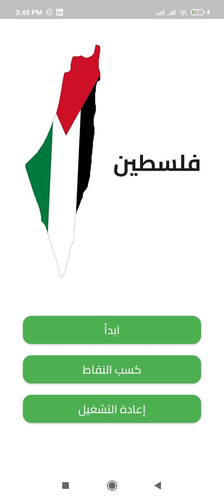
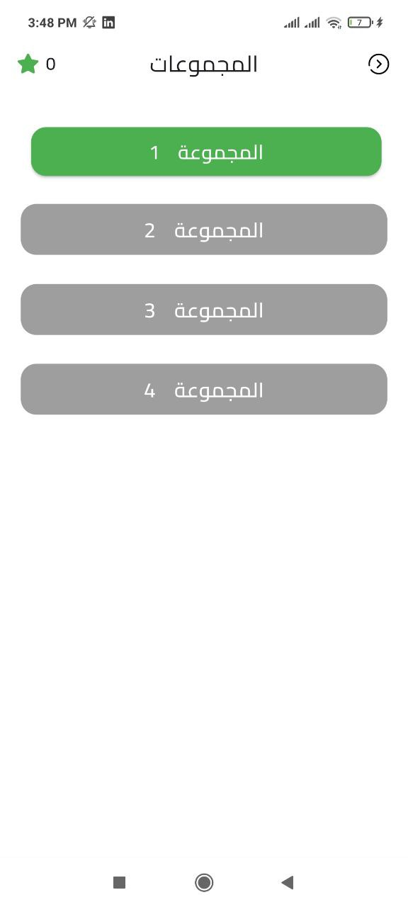
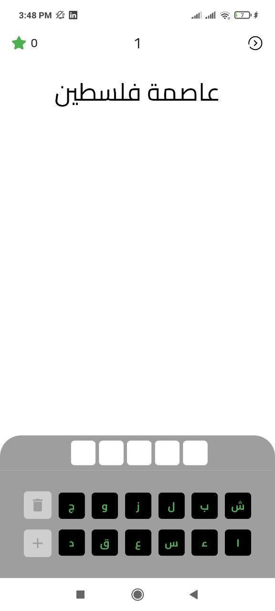
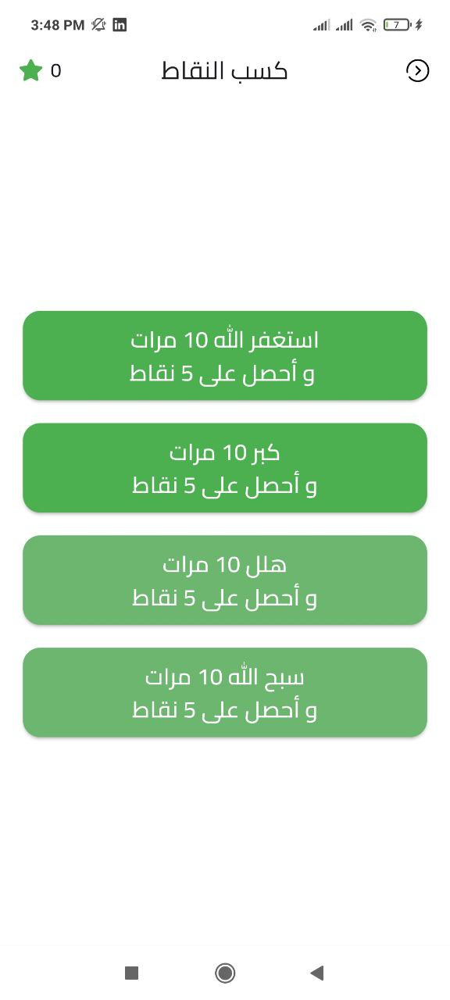
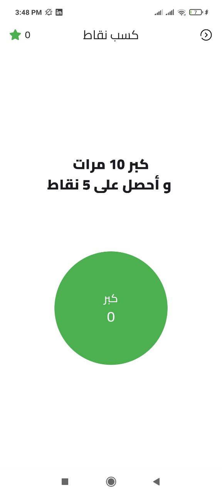

# Palestine Puzzle App

Welcome to the Palestine Puzzle App, a Flutter-based application designed to offer an engaging and educational experience about Palestine. This project features a range of questions covering general knowledge about Palestine, making learning fun and interactive.

# Video Demo 
[](https://youtu.be/zJp3S5OVMQk)

## Features
- **Educational Questions:** A variety of questions covering general knowledge about Palestine.
- **Engaging Gameplay:** Interactive and fun way to learn about Palestine.
- **User-Friendly Interface:** Simple and intuitive UI/UX design.
- **Cross-Platform:** Runs smoothly on both Android and iOS devices.







## Usage

### APK: [download from here](https://drive.google.com/file/d/1QYUNFgkA6IlrrqZQnbw3tQPfggiLDI88/view?usp=drive_link)
1. Open the app on your device.
2. Navigate through different questions about Palestine.
3. Answer questions and learn more about the rich history and culture of Palestine.
4. Enjoy the interactive experience and test your knowledge.

## Installation

### Prerequisites
- Flutter SDK: [Flutter installation guide](https://flutter.dev/docs/get-started/install)
- Dart SDK: Included with Flutter
- Visual Studio Code [Download VS code](https://code.visualstudio.com/)

### Steps
1. **Clone the repository**

2. **Install dependencies:**
    ```bash
    flutter pub get
    ```
3. **Run the app:**
    ```bash
    flutter run
    ```
